# Dual-Mode Dispatcher

One Tray.io workflow that handles two completely different ticket-submission origins through one converged transition path. Picks Jira keys two different ways (regex on a batch ID, or a JQL custom-field search), then runs the same idempotent transition logic against both.

## Problem

We had tickets entering our pipeline from two different sources with different metadata shapes, and we needed one automation to handle both without duplicating logic. Source A submits a batch identifier that already contains the Jira key (a project prefix plus a number). Source B submits only a business ID, and the Jira key has to be looked up by querying a custom field. Both classes of ticket then progress through the same lifecycle (Pending Auto-Build to a downstream state once a backend job reports complete), so the actual transition logic is identical. Duplicating that logic into two parallel workflows would double the maintenance surface and double the chance of drift. One workflow with a single dispatch step at the top was the better tradeoff.

## At a glance

| Field | Value |
|---|---|
| Trigger | Scheduled, hourly |
| Source | A Snowflake table populated by a separate Snowflake task |
| Action | Transitions Jira tickets through the catalog build lifecycle |
| Connectors | Snowflake, Jira REST API v3, JavaScript script steps |
| Workflow shape | One trigger, one Snowflake read, one loop, two parallel resolution branches that converge on a shared transition path |

## Architecture

The trigger fires hourly. One Snowflake step reads the materialized `PROD_DB.AUTOMATION.task_status` table. A loop iterates each row. A boolean condition splits on `BATCH_TYPE`: rows tagged `SSIO` take the right branch, everything else (`CATALOG_TEAM` and friends) takes the left. The left branch resolves the Jira key with two text-helper steps (regex match, then replace) against the `BATCH_ID` column. The right branch resolves the Jira key with a script-built JQL body, a POST to Jira's search endpoint, then a script that parses the response. Both branches then run identical downstream chains: GET the issue, check that the job is COMPLETE and the ticket is still in `Pending Auto-Build`, build the transition payload, POST the transition.

```mermaid
%%{init: {'flowchart': {'nodeSpacing': 25, 'rankSpacing': 30}, 'themeVariables': {'fontSize': '13px'}}}%%
flowchart TD
    T[Scheduled Trigger<br/>hourly]
    SQL[Snowflake: read<br/>task_status table]
    L[Loop rows]
    B{BATCH_TYPE<br/>== SSIO?}

    RX[Regex extract<br/>INTAKE-#&#92;d+&#125;&#41; from BATCH_ID]
    GC[GET Jira issue<br/>by extracted key]
    GateC{JOB status COMPLETE<br/>AND ticket status<br/>Pending Auto-Build?}
    TC[POST transition<br/>catalog branch]

    JB[Build JQL body<br/>from BUSINESS_IDS]
    JQL[POST Jira<br/>&#47;search&#47;jql]
    EX[Extract issue key<br/>from JQL response]
    GS[GET Jira issue<br/>by extracted key]
    GateS{JOB status COMPLETE<br/>AND ticket status<br/>Pending Auto-Build?}
    TS[POST transition<br/>SSIO branch]

    T --> SQL --> L --> B
    B -- false --> RX --> GC --> GateC -- yes --> TC
    B -- true --> JB --> JQL --> EX --> GS --> GateS -- yes --> TS
```



The diagram source is also at [`architecture.mmd`](./architecture.mmd) if you want to render it elsewhere.

## The interesting parts

### Separating the heavy SQL from the workflow

The query that produces the input rows is not cheap. It joins job-status tables, aggregates SKU counts, and normalizes batch metadata across two ingestion paths. Running it inline as the workflow's Snowflake step is technically possible but a bad idea. The Tray Snowflake connector has a hard timeout, and any query that brushes against it produces an inconsistent failure mode: sometimes the connector returns partial rows, sometimes it returns a connector error, sometimes the workflow run just hangs.

I split it. The expensive query runs as a Snowflake task on its own warehouse on its own schedule, and writes its output to `PROD_DB.AUTOMATION.task_status`. The Tray workflow does a trivial `SELECT * FROM task_status`. That read finishes in well under a second regardless of how heavy the upstream computation is. Snowflake owns the SQL, Tray owns the orchestration, and the timeout class of bug stops existing.

The other benefit: when something breaks, the failure surface is split too. A bad row in the table is a SQL problem you debug in Snowflake. A bad transition is a Tray problem you debug in the workflow. They no longer entangle.

### Two ID resolution strategies in one workflow

The two branches handle the metadata-shape mismatch.

**CATALOG_TEAM rows** carry their Jira key inside `BATCH_ID`. The string looks like `something-INTAKE-12345-suffix`. I extract the key with a `text-helpers` regex `.*(INTAKE-\d+).*` and capture group 1. Cheap, no API call.

**SSIO rows** carry only a business ID. The Jira key is unknown until we ask Jira. I build the JQL body in a script step:

```js
var jql =
  'cf[<CF_BUSINESS_ID>] = "' + bid + '" ' +
  'AND summary ~ "SSIO" ' +
  'AND status = "Pending Auto-Build" ' +
  'ORDER BY created DESC';
```

POST that to `/rest/api/3/search/jql`, then parse the first issue key out of the response:

```js
var issues = body && body.issues;
if (Array.isArray(issues) && issues.length > 0 && issues[0].key) {
  return issues[0].key;
}
return "";
```

The JQL approach is the interesting half. `<CF_BUSINESS_ID>` is a Jira custom field that holds the same business ID we have in the Snowflake row. The custom field acts as a join key across two systems that don't share a primary key. Returning `""` instead of throwing gives us a soft skip: the downstream boolean condition checks for empty and exits the iteration cleanly. Full snippets in [`snippets/jql-body-builder.js`](./snippets/jql-body-builder.js) and [`snippets/extract-ssio-key.js`](./snippets/extract-ssio-key.js).

### Per-branch step namespacing

Every step downstream of the BATCH_TYPE split exists twice, once per branch, with `-c` (catalog) or `-s` (ssio) suffixes: `http-client-1-c` and `http-client-1-s`, `json-transformer-1-c` and `json-transformer-1-s`, and so on. The actual logic inside each pair is identical except for the jsonpath bindings.

I considered the obvious DRY alternative: one downstream chain, with conditional jsonpaths that pull the Jira key from either `text-helpers-2.result` or `script-extract-ssio-key.result` depending on which branch ran. It works for one or two steps but degrades fast. Tray's jsonpath resolution does not have a clean conditional. You end up with deeply nested coalesce expressions or a "merge" script step whose only purpose is to pick the non-empty value. Both are more fragile than just duplicating the chain. Steps are free. Coupling is not.

The tradeoff is explicit: more steps in the workflow, less coupling between branches. When the catalog branch needs a change that doesn't apply to SSIO (or vice versa), I edit one chain and leave the other alone. No accidental cross-branch regressions.

### Idempotent transition guard

The boolean condition just before each POST transition requires **both** of:

1. The Snowflake row's `JOB_PIPELINE_STATUS === "COMPLETE"`
2. The Jira ticket's current status equals `"Pending Auto-Build"`

The first check alone would be insufficient. Snowflake tells us the upstream job is done; it does not tell us whether the ticket has already been moved off `Pending Auto-Build` by a human or by a previous run of this workflow. Without the second check, every hourly run would re-POST the transition against tickets already past that state. Jira would return a 4xx for each, the workflow would log noisily, and we'd lose the signal in the noise.

Adding the live status check makes the transition idempotent at the Jira layer: if the ticket is no longer in `Pending Auto-Build`, the workflow simply skips it. Reruns are safe. Backfills are safe. Manual interventions don't fight the automation.

## Reusable patterns

- [ID resolution: regex vs JQL search](../../patterns/id-resolution-strategies.md)
- [Idempotent skip gates](../../patterns/idempotent-skip-gates.md)
- [Per-branch namespacing to avoid jsonpath coupling](../../patterns/per-branch-namespacing.md)

## Skills demonstrated

- Tray.io workflow architecture across nested boolean branches
- JSONata expressions for transition mapping
- JavaScript script steps for API request body construction and response parsing
- Jira REST API v3 (GET issue, POST transition, POST `/search/jql`)
- Snowflake integration with task-table separation pattern
- Defensive workflow design (idempotency guards, status verification before action)
