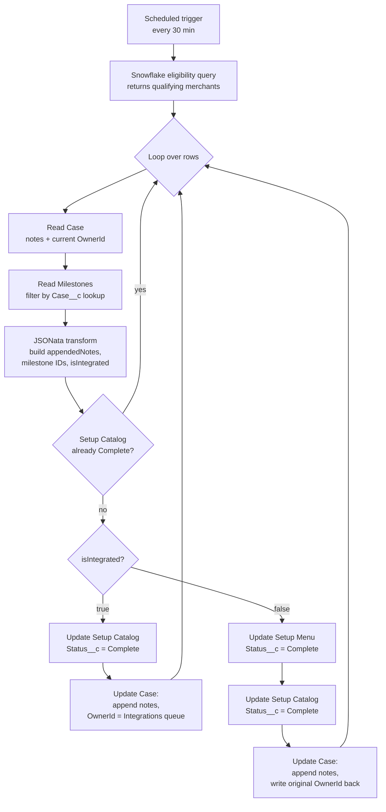

# Salesforce Milestone Auto-Graduation

A scheduled Tray workflow that turns a manual onboarding graduation gate into an automated one. Snowflake decides who is eligible, Salesforce gets the milestone updates, and a defensive owner read-back pattern keeps cases from drifting out of their queue.

## Problem

Merchant onboarding had a manual graduation gate. Analysts pulled a coverage report, checked whether each merchant cleared a catalog-quality threshold, then went into the CRM to mark milestones complete and route the case to the next queue. Mechanical but slow, and merchants who cleared the bar overnight sat for a day before anyone noticed. The goal here was simple: run the same check every 30 minutes and apply the same updates, without ever moving a case into the wrong queue.

## At a glance

| Field | Value |
|---|---|
| Trigger | Scheduled, every 30 minutes |
| Source | A Snowflake eligibility query |
| Action | Updates Salesforce custom milestones, appends notes, routes case ownership |
| Connectors | Snowflake, Salesforce REST API (custom object support), JSONata |
| Idempotency | Skip-if-already-processed gate keyed on milestone completion state |

## Architecture

A scheduled trigger fires every 30 minutes and runs the Snowflake eligibility query. Each returned row is one qualifying merchant; the loop processes them one at a time. Per iteration, the workflow reads the Case (for current notes and current `OwnerId`), reads the linked custom milestones, and runs a single JSONata transform that produces three outputs: the appended notes string, the milestone IDs by name, and an `isIntegrated` boolean. A skip gate checks whether the Setup Catalog milestone is already Complete; if so, the iteration ends. Otherwise the flow branches on integration status. Integrated merchants get one milestone marked Complete and move to the POS Integrations queue. Non-integrated merchants get two milestones marked Complete and stay in their current queue, with the original `OwnerId` explicitly written back.



## The interesting parts

### Custom milestones, not standard CaseMilestone

Salesforce ships a standard `CaseMilestone` object tied to Entitlement Processes. Wrong fit here: this team models its onboarding stages with a custom `Milestone__c` object linked to Case through a `Case__c` lookup field, with its own status picklist (`Status__c`) and its own naming. The workflow does not touch the standard milestone object at all.

Trade-off: there is no "update milestone by name" API. To mark "Setup Catalog" complete, I first read the milestones for the case, filter them in JSONata by name to find the right `Id`, then call `update_record` against `Milestone__c` with that `Id`. Three steps where a standard-object workflow would have been one.

The lookup is a single line of JSONata:

```jsonata
$setupCatalogId := $filter(milestones, function($m) { $m.Name = 'Setup Catalog' })[0].Id;
```

See [`snippets/milestone-id-lookup.jsonata`](snippets/milestone-id-lookup.jsonata) for the full transform, which also returns the milestone's current `Status__c` so the idempotency gate has something to read.

### Owner-preservation safety

Both branches do a Case update at the end. The integrated branch intentionally changes `OwnerId` (it routes the case to the POS Integrations queue). The non-integrated branch only wants to append notes; it has no intent to change ownership. The naive version of that update would just omit `OwnerId` from the field set, on the assumption that Salesforce will leave it alone.

Salesforce will not always leave it alone. Assignment rules can fire on a Case update and silently overwrite `OwnerId`, even when `toggle_active_assignment_rules` is set to "Disable active assignment rules" on the Tray side. Different orgs have different layers of automation (assignment rules, flows, Apex triggers, Process Builder remnants), and at least one of those layers in this org would reassign the case under specific field combinations. No error, no log entry, just a case that quietly moved queues overnight.

So the non-integrated branch does this instead: it reads `OwnerId` at the start of the iteration (the same `salesforce-1` find step that pulls notes), and it writes that exact value back at the end of the update. If something downstream tries to reassign the case, this update overwrites it with the original owner. If nothing tries to reassign it, the write is a no-op. The trade-off is one extra field in the update payload and a small risk of clobbering a legitimate concurrent reassignment, which is acceptable because legitimate reassignments on these cases come from this workflow.

Silent ownership drift is the worst kind of bug because nothing fails loudly. The defensive write is cheap; the cost of not having it is debugging a queue-routing mystery a week later.

### Skip-if-already-processed gate

The first thing the workflow checks per iteration: is the Setup Catalog milestone already `Complete`? If yes, the iteration short-circuits.

Without this gate, every 30-minute run would re-process every still-eligible merchant. The Snowflake query has no awareness of whether a merchant has been graduated yet; it only knows whether the merchant meets the data-quality bar. A merchant who cleared the bar yesterday still clears it today, so the query would return the same row 48 times before something else changed to drop them from the result set.

The gate makes the workflow idempotent across runs. The first run does the work. Every subsequent run reads the milestone, sees it is Complete, and exits the iteration. The notes column does not accumulate duplicate dated entries, the milestones are not re-stamped, and the owner is not touched. This also makes the workflow safe to re-run manually after a transient failure.

### Two-path branching on integration status

The Snowflake query carries forward `pos_provider` from the merchant's representative store row. That value drives the integrated / non-integrated split:

```jsonata
$isIntegrated := posProvider != null
                 and posProvider != ''
                 and posProvider != 'non_integrated_mx';
```

Three conditions instead of one truthy check, because each one catches a different real case. `null` is the store row missing the POS field entirely. Empty string is the field present but blank. `'non_integrated_mx'` is the upstream catalog system's explicit sentinel for a deliberately non-integrated merchant; it is a truthy string, so a plain `if (posProvider)` would route these the wrong way.

Integrated merchants only need Setup Catalog marked complete and get routed to the POS Integrations queue, where the next team picks them up. Non-integrated merchants need both Setup Menu and Setup Catalog marked complete (different onboarding shape) and stay in whatever queue they were already in. The full transform is in [`snippets/integration-status-check.jsonata`](snippets/integration-status-check.jsonata).

## The Snowflake query

The eligibility query identifies merchants in a regulated product category whose catalogs have crossed a data-quality bar. It pulls the closed-won implementation requests, joins to store metadata for the POS field, computes per-merchant SKU coverage against a canonical mapping table, looks up the open Salesforce case for each merchant, and returns the rows that meet three thresholds (≥70% mapped, >100 SKUs, store still inactive). The literal SQL is not in this repo; a pseudocode CTE-by-CTE walkthrough lives at [`snippets/eligibility-query-pseudocode.md`](snippets/eligibility-query-pseudocode.md).

## Reusable patterns

- [Owner preservation: read-then-write-back](../../patterns/owner-preservation.md)
- [Idempotent skip gates](../../patterns/idempotent-skip-gates.md)
- [Dated note appending](../../patterns/note-appending.md)

## Skills demonstrated

- Salesforce REST API including custom object updates (`Milestone__c`)
- JSONata patterns: `$filter`, `$now('[M01].[D01].[Y0001]')`, conditional concatenation
- Defensive iPaaS design (read-back safety, idempotent gates)
- Snowflake-to-Salesforce pipeline architecture
- Salesforce assignment-rule awareness (`toggle_active_assignment_rules` discovery)
