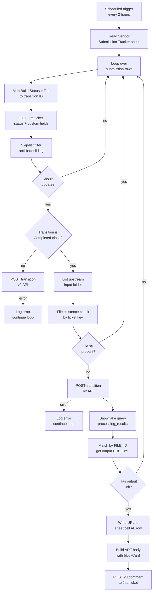

# Multi-System State Verification

A Tray.io workflow that treats its primary signal (a vendor-edited Google Sheet) as a suggestion and verifies it against a second system (Google Drive folder listing) before transitioning Jira tickets. When the two systems agree, it closes the loop in both directions: writing a downstream output URL back into the sheet, and posting a rich smart-link comment on the ticket using Jira's v3 ADF API.

## Problem

Vendors logged build progress in a shared sheet, but the sheet alone wasn't enough proof that the work was done. We needed the automation to confirm the downstream system had also consumed the file before transitioning the corresponding ticket. Without that second-system check, tickets would move forward while the work was still in flight, and the catalog team would catch the discrepancy too late. The same automation also had to push the downstream output link back to the sheet (so vendors didn't have to dig for it) and surface it on the Jira ticket itself (so the next person picking up the ticket could open the file in one click).

## At a glance

| Field | Value |
|---|---|
| Trigger | Scheduled, every 2 hours |
| Source | A Google Sheet (vendor submission tracker), with secondary verification against a Google Drive folder |
| Action | Transitions Jira tickets, writes the downstream output file URL back to the sheet, posts a smart-link card comment on the Jira ticket |
| Connectors | Google Sheets, Google Drive, Snowflake, Jira REST API v3 (including ADF `blockCard`) |
| Workflow shape | Linear trigger / read / loop with a three-deep nested branch when the transition is one of the terminal "completed" ones |

## Architecture

The workflow fires every two hours, reads the active rows out of the Vendor Submission Tracker, and loops over each row. For each row it maps Build Status and Tier to a Jira transition ID, fetches the ticket to read its current status, and runs the skip-list filter to decide whether action is warranted. If the transition is one of the non-terminal ones (Escalated, In Progress) it POSTs the transition straight to the v2 API. If the transition is one of the terminal "completed" ones it first lists the upstream input folder in Drive and checks whether a file containing the ticket key is still sitting there. Only if the file is gone (meaning the downstream auto-build service has finished consuming it) does the workflow proceed: POST the transition, query Snowflake for the matching processed-file record, write the output URL back into the source sheet, then post an ADF `blockCard` comment on the ticket pointing at that same URL.



## The interesting parts

### Don't trust your primary source: the file-existence cross-check

The sheet's `Build Status` column is updated by vendors, by hand. The actual definition of "done" lives somewhere else: a downstream auto-build service that picks up input files from a shared Drive folder and removes them once it has produced an output. Those two systems disagree all the time. A vendor flips the row to Completed the moment they finish their part; the auto-build service finishes minutes or hours later. If the workflow transitioned the Jira ticket the moment the row said Completed, half the time the ticket would be marked as auto-built before the auto-build had actually happened.

So when the mapped transition is in the "completed" class, the workflow inserts a verification step. It lists the upstream input folder and looks for any filename containing the ticket key:

```jsonata
{
  "fileFound": $count(
    $filter(files, function($f) {
      $exists(issueKey."Issue Key")
        ? $contains($f.name, issueKey."Issue Key")
        : false
    })
  ) > 0
}
```

If the input file is still there, the auto-build service hasn't finished, the workflow skips this row, and the next 2-hour run re-checks. If the file is gone, the auto-build is done and the transition is safe to fire. It is a cheap check (one Drive `list_files` call per loop iteration) but it eliminated the largest source of false-positive transitions in this pipeline.

### Two-way data flow back to the sheet

After a successful transition, the workflow queries Snowflake for the last few days of processed-file records, matches the loop row's input file value against the table's `FILE_ID` column, and writes the resulting output URL back to column AL of the same row. The vendor team's view of "is this done" now includes the downstream output link automatically, with no one copying URLs around by hand.

```jsonata
(
  $match := $filter($.mapping, function($f) {
    $contains($string($.inputFile."Upstream Input File"), $f.FILE_ID)
  });

  {
    "result":   $match[0].OUTPUT_FILE_LINK ? $match[0].OUTPUT_FILE_LINK : "",
    "cell":     "AL" & $string($.inputFile.Row),
    "has_link": $exists($match[0].OUTPUT_FILE_LINK)
  }
)
```

The detail worth flagging is the cell address. The loop emits its current iteration's row number as `$.inputFile.Row`, and the JSONata builds the target cell on the fly as `"AL" & $string(row.Row)`. The Sheets update step then takes that as a direct cell reference. No client-side bookkeeping, no off-by-one risk because the row number rides along with the data through the loop.

### Rich-content Jira comments with smart-link previews

Once the URL is back in the sheet, the workflow posts a comment on the Jira ticket pointing at the same URL. The catch: a plain-text comment with a bare URL renders as a bare URL. The team picking up the ticket sees a string, has to copy it, paste it into a new tab. That is a small papercut multiplied by hundreds of tickets a week.

Jira's v3 REST API takes an ADF (Atlassian Document Format) document instead of a plain string. ADF is a typed JSON tree: a root `doc`, with `paragraph` children, which contain `text` nodes with optional `marks` (`strong`, `em`, etc.), plus structural nodes like `blockCard`. A `blockCard` with a URL renders in the Jira UI as a smart-link card with the destination's icon and title, hover preview, and click-through.

```jsonata
{
  "body": {
    "type": "doc",
    "version": 1,
    "content": [
      {
        "type": "paragraph",
        "content": [
          { "type": "text", "text": "Done. " },
          {
            "type": "text",
            "text": "Auto-Build output ready",
            "marks": [{ "type": "strong" }]
          }
        ]
      },
      {
        "type": "blockCard",
        "attrs": { "url": link.result }
      },
      {
        "type": "paragraph",
        "content": [
          {
            "type": "text",
            "text": "(Automated message)",
            "marks": [{ "type": "em" }]
          }
        ]
      }
    ]
  }
}
```

Tradeoff worth naming: authoring an ADF document is more verbose than dropping a string into a v2 comment body. For a one-line throwaway message, v2 is the right call. For a handoff signal that humans will act on (and where a one-click file open matters) the rendered preview pays for the extra structure many times over.

### Build Status + Tier to transition mapping

The first transformation in the loop is a nested ternary that turns two free-text sheet columns into a Jira transition ID:

```jsonata
$transitionId :=
  $lowercase($buildStatus) = "escalated"   ? "461" :
  $lowercase($buildStatus) = "in progress" ? "511" :
  $lowercase($buildStatus) = "completed"   ?
    ($lowercase($tier) = "enterprise" ? "601" : "6") :
  "";
```

Three things to notice. First, the comparison is case-insensitive (`$lowercase`) because the source sheet has both "Completed" and "completed" depending on who edited it last. Second, "not started" and blank both collapse to an empty string, which the downstream filter treats as "skip this row." Third, the only place where Tier matters is the Completed branch: Local and Enterprise tickets follow different terminal paths through the Jira workflow, so a single Build Status value isn't enough to pick the transition.

### Anti-backsliding skip list

The workflow runs every two hours against an effectively append-only sheet, so any given row can sit at "Completed" for days while its corresponding ticket has long since moved on through downstream QA stages. Without a guard, each run would try to push the ticket back to "Auto-Build Complete" even after a human has resolved it.

The skip list:

```jsonata
$skip := [
  "Auto-Build Complete",
  "Pending Size Inference",
  "Catalog QA",
  "Upload",
  "Collections",
  "Blocked",
  "Resolved",
  "Done",
  "Reopened",
  "In Final Review",
  "Pending Verification",
  "Won't Do"
];
```

Three guards combine: the ticket's current status is in the skip list, the service type isn't the one this automation handles, or the ticket is already at the target transition. Any one of them is enough to bail out. The list grew as production failures surfaced edge cases (someone manually moved a ticket to Blocked, someone resolved a ticket as Won't Do, etc.) so it reads as a small archaeology of "things that went wrong once."

## Reusable patterns

- [ADF rich comments with smart-link cards](../../patterns/adf-rich-comments.md)
- [Cross-system state verification](../../patterns/cross-system-verification.md)
- [Idempotent skip gates](../../patterns/idempotent-skip-gates.md)
- [Error handling with downstream alerting](../../patterns/error-handling-with-alerting.md)

## Skills demonstrated

- Multi-connector workflow design (Sheets, Drive, Snowflake, Jira in one flow)
- Cross-system state reconciliation
- ADF authoring for rich Jira API content (`blockCard`, `paragraph`, `text` with marks)
- Two-way data flow (read sheet, act, write back to same sheet)
- Tray.io nested boolean conditions with error-branch handling
- JSONata across `$filter`, `$contains`, `$exists`, `$match`, `$count`
